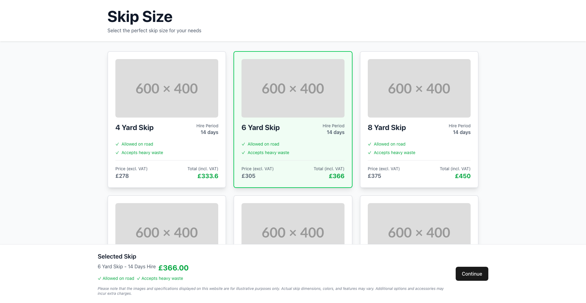
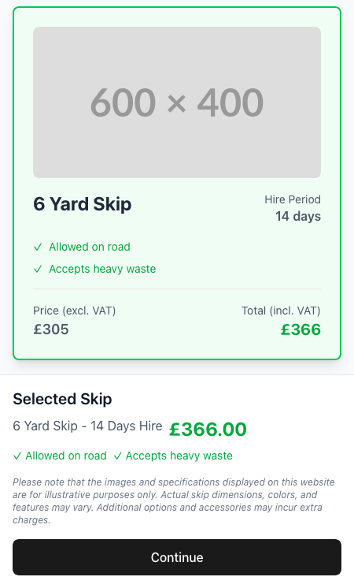

# Business Skip Hire App

A modern, responsive web application for skip hire services. Built with React, TypeScript, and Tailwind CSS.

[Demo](https://simple-one-page-redesign.vercel.app)

## Desktop View


## Mobile View


## Features

- 🎯 Clean, modern UI with responsive design
- 📱 Mobile-first approach
- 🎨 Beautiful animations and transitions
- ⚡ Fast and efficient performance
- 🔍 Clear skip size selection
- 💰 Transparent pricing display
- 🚫 Clear indication of restrictions
- 🎯 Easy skip selection process

## Tech Stack

- React
- TypeScript
- Vite
- Tailwind CSS
- Framer Motion (for animations)

## Prerequisites

- Node.js (v16 or higher)
- npm (v7 or higher)

## Getting Started

1. Clone the repository:
```bash
git clone [repository-url]
cd simple-one-page-redesign
```

2. Install dependencies:
```bash
npm install
```

3. Copy `.env.example` and save it as `.env` and update the credentials

4. Start the development server:
```bash
npm run dev
```

5. Build for production:
```bash
npm run build
```

## Docker Support

The application includes Docker configuration for easy deployment:

use Docker Compose:
```bash
docker-compose up --build
```